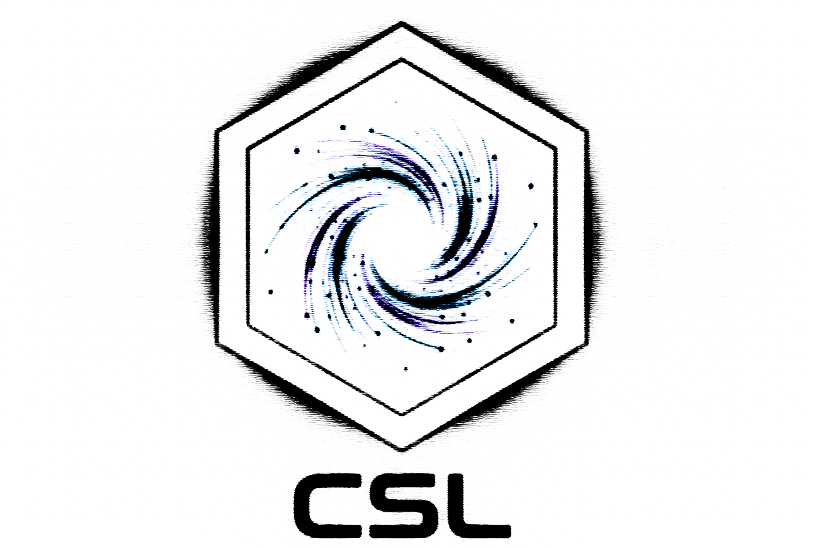

# compress-shader-literals

> **Size matters.** Strip everything strippable from your GLSL & WGSL shaders at build time.

[](https://www.npmjs.com/package/compress-shader-literals)
[](https://bundlephobia.com/package/compress-shader-literals)
[](https://www.npmjs.com/package/compress-shader-literals)
[](./LICENSE)

Comments, indentation, blank lines — gone from your `glsl` / `wgsl` literals before your bundler even runs. Zero source changes, full sourcemaps. One [unplugin](https://github.com/unjs/unplugin) for **Vite, Rollup, webpack, esbuild, Rspack, Rolldown & Farm**.



## Stats

Measured on the real shaders shipped by popular libraries:

<!-- STATS:START -->

| Package               | Shaders |    Before |     After |     Saved |
| --------------------- | ------: | --------: | --------: | --------: |
| `three`               |     281 | 240,772 B | 203,428 B | **15.5%** |
| `@jayf0x/fluidity-js` |       9 |   9,524 B |   7,133 B | **25.1%** |
| `ogl`                 |      22 |   6,109 B |   5,335 B | **12.7%** |
| `shader-park-core`    |      18 |  10,794 B |   9,033 B | **16.3%** |
| `curtainsjs`          |       7 |   3,406 B |   2,563 B | **24.8%** |
| **Total**             |     337 | 270,605 B | 227,492 B | **15.9%** |

_Auto-generated by [`tests/e2e.js`](tests/e2e.js) · packages [verified](tests/validate.js) loadable · 2026-06-23_

<!-- STATS:END -->

## Install

```sh
npm i -D compress-shader-literals
# or: bun add -d compress-shader-literals
```

## Usage

Pick your bundler — same plugin, same options:

```js
import { compressShaderLiterals } from 'compress-shader-literals';

// Vite        vite.config.js
export default { plugins: [compressShaderLiterals.vite({ outputRatio: true })] };

// Rollup      rollup.config.js   →  compressShaderLiterals.rollup({ ... })
// webpack     webpack.config.js  →  compressShaderLiterals.webpack({ ... })
// esbuild     build script       →  compressShaderLiterals.esbuild({ ... })
// Rspack / Rolldown / Farm       →  .rspack() / .rolldown() / .farm()
```

## Options

| Option        | Default                      | Description                             |
| ------------- | ---------------------------- | --------------------------------------- |
| `tags`        | `['glsl', 'wgsl', 'shader']` | Tag names / comment markers to match    |
| `include`     | `[/\.[jt]sx?$/]`             | Files to process                        |
| `exclude`     | `[/node_modules/, /dist/]`   | Files to skip                           |
| `outputRatio` | `false`                      | Print a bytes-saved summary after build |

---

## What it compresses

```ts
// Tagged template literal
const vert = glsl`
  // vertex shader  ← stripped
  precision highp float;
  void main() { gl_Position = vec4(0.0); }
`;

// Comment-prefixed template literal (keeps editor syntax highlighting)
const frag = /* wgsl */ `
  /* fragment */
  fn main() {}
`;
```

Both collapse to a single tight line — no comments, no padding.

## How it works

1. Parses each matched file with Babel (TS/JSX aware).
2. Finds tagged and comment-prefixed shader literals.
3. Strips comments + collapses whitespace via [`magic-string`](https://github.com/Rich-Harris/magic-string), so **sourcemaps stay intact**.
4. Runs as a `pre` transform, so your bundler's own minifier still sees the result.

## License

[MIT](./LICENSE) © [jayF0x](https://github.com/jayf0x)
